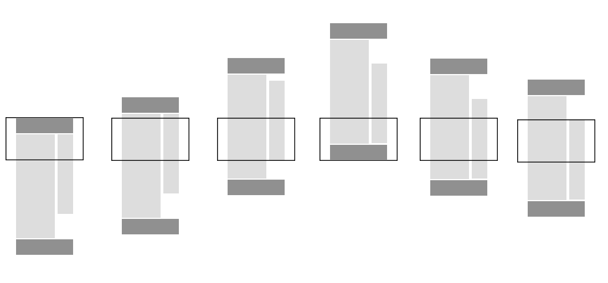

[Sticky Sidebar ⬆⬇](http://github.com/abouolia/sticky-sidebar) is a pure JavaScript plugin for making smart and high performance sticky sidebar, works with sidebar if it's taller or shorter than the viewport, integrated with [resize sensor](https://github.com/marcj/css-element-queries/blob/master/src/ResizeSensor.js) to re-calculate the dimensions automatically when the size of sidebar or its container is changed, supports jQuery/Zepto and compatible with Firefox, Chrome, Safari, and IE9+. Source can be found on [Github](http://github.com/abouolia/sticky-sidebar).

<iframe src="https://ghbtns.com/github-btn.html?user=abouolia&amp;repo=sticky-sidebar&amp;type=watch&amp;count=true&amp;size=large"
  allowtransparency="true" frameborder="0" scrolling="0" width="170" height="30"></iframe>



0. [Why sticky sidebar is awesome?](#why-sticky-sidebar-is-awesome)
1. [Examples](#examples)
2. [Installation](#installation)
3. [Usage](#usage)
4. [Configure Your CSS](#configure-your-css)
5. [Options](#options)
6. [Events](#events)
7. [Public Methods](#public-methods)
8. [Scrolling Performance](#scrolling-performance)
9. [Browser Compatibility](#browser-compatibility)
10. [jQuery/Zepto No Conflict](#jqueryzepto-no-conflict)

### Why sticky sidebar is awesome? 
* It does not re-calculate all dimensions when scrolling, just neccessary dimensions.
* Super smooth without incurring scroll lag or jank and no page reflows.
* Integrated with resize sensor to re-calculate all dimensions of the plugin when the size of sidebar and its container is changed.
* It has event trigger on each affix type to hook your code under particular situations.
* Handle the sidebar when it is tall or too short compared to the rest of the container.
* Zero dependencies and super simple to setup.

## Examples

#### Basic 

Just call ``new StickySidebar('ELEMENT')`` on the element that you want it to be sticky when scrolling up/down inside their parent.


var sidebar = new StickySidebar('#sidebar', {topSpacing: 20});


<div class="box-demo-button-wrapper">
	<button>Scroll It!</button>
	<div class="clearfix"></div>
</div>

<div class="box-demo">
	<div class="box-demo__header">
		<span class="box-demo__title">Basic Demo</span>
	</div>
	<div class="box-demo__inner">
		<iframe src="./examples/example1.html" width="100%" height="220"></iframe>
	</div>
</div>

<a href="./examples/basic.html" target="_blank">Basic Example</a>

#### Scrollable Sticky Element

Sticky sidebar is smart enough to handle sidebar when it's taller than the viewport. You don't have to worry about content, it will scroll the sidebar independently, up and down.


var sidebar = new stickySidebar('#sidebar', {topSpacing: 20});


<div class="box-demo-button-wrapper">
	<button>Scroll It!</button>
	<div class="clearfix"></div>
</div>

<div class="box-demo">
    <div class="box-demo__header">
		<span class="box-demo__title">Scrollable Sticky Element</span>
	</div>
	<div class="box-demo__inner">
		<iframe src="./examples/example2.html" width="100%" height="220"></iframe>
	</div>
</div>

<a href="./examples/scrollable-element.html" target="_blank">Scrollable Sticky Element</a>

--------------------------

## Installation

You can install sticky sidebar plugin from Bower, NPM or just simply download it from <a href="#">GitHub</a> then put ``sticky-sidebar.js`` file into your project folder.

#### Bower

If you are using Bower as package manager:

````
bower install sticky-sidebar
````

#### NPM

If you are using NPM as package manager:

````
npm install sticky-sidebar
````

------------------------

## Usage

Your website's HTML structure has to be similar to this in order to work:


<div id="main-content" class="main">
    <div id="sidebar" class="sidebar">
        <div class="sidebar__inner">
            <!-- Content goes here -->
        </div>
    </div>
    <div id="content" class="content">
        <!-- Content goes here -->
    </div>
</div>


Note that inner sidebar wrapper ``.sidebar__inner`` is optional but highly recommended, if you don't write it yourself, the script will create one for you under class name ``inner-wrapper-sticky``, but this may cause many problems.

For the above example, you can use the following JavaScript:


<script type="text/javascript" src="./js/sticky-sidebar.js"></script>

<script type="text/javascript">
    var sidebar = new StickySidebar('#sidebar', {
        containerSelector: '#main-content',
        innerWrapperSelector: '.sidebar__inner',
        topSpacing: 20,
        bottomSpacing: 20
    });
</script>


### Usage with jQuery/Zepto

You can configure sticky sidebar as a jQuery plugin, just include ``jquery.sticky-sidebar.js`` instead of ``sticky-sidebar.js`` file than configure it as any jQuery plugin.


$('#sidebar').stickySidebar({
    topSpacing: 60,
    bottomSpacing: 60
});


Make sure to include ``jquery.sticky-sidebar.js`` script file after ``jquery.js``.

### Usage with [ResizeSensor.js](https://github.com/marcj/css-element-queries/blob/master/src/ResizeSensor.js)

Integrate [ResizeSensor.js](https://github.com/marcj/css-element-queries/blob/master/src/ResizeSensor.js) into sticky sidebar to detect when sidebar or container is changed. To use resize sensor with this plugin just make sure to include [ResizeSensor.js](https://github.com/marcj/css-element-queries/blob/master/src/ResizeSensor.js) before `sticky-sidebar.js` code whether through module loader, bundle or event inclusion as a `<script>` and enable `resizeSensor` option (enabled by default) and it will work.

If you choose not to include `ResizeSensor.js`, sticky sidebar will not have automatic resize detection and still continue to work without any problem.

--------------------------

## Configure Your CSS

Next you are going to need some CSS just to improve performance and prevent repainting on scrolling. Sticky sidebar plugin doesn't add below styles as inline so you need to add them manually in your stylesheet.


.sidebar{
    will-change: min-height;
}

.sidebar__inner{
    transform: translate(0, 0); /* For browsers don't support translate3d. */
    transform: translate3d(0, 0, 0);
    will-change: position, transform;
}



-----------------

## Options

Sticky sidebar plugin comes with options to configure how it works. All options below are optional. Default values are presented below.



var stickySidebar = new StickySidebar('#sidebar', {
    topSpacing: 0,
    bottomSpacing: 0,
    containerSelector: false,
    innerWrapperSelector: '.sidebar__inner',
    resizeSensor: true,
    stickyClass: 'is-affixed',
    minWidth: 0
});



#### topSpacing

Additional top spacing of the element when it becomes sticky. ``Default: 0``.


var sidebar = new StickySidebar('.sidebar', {topSpacing: 50});


#### bottomSpacing

Additional bottom spacing of the element when it becomes sticky. ``Default: 0``.


var sidebar = new StickySidebar('.sidebar', {bottomSpacing: 50});


#### containerSelector

Specify a container sidebar to limit the begin and end points of sticky element.
Defaults to the closest parent of the sticky element. It is highly recommended to specify a container selector.


var sidebar = new StickySidebar('.sidebar', {containerSelector: '.container'});


#### innerWrapperSelector

Inner wrapper selector of sticky sidebar, if this wrapper is not found inside sidebar element, the plugin will create one for you under class name ``inner-wrapper-sticky``. It is highly recommended to write inner wrapper of sidebar yourself than add its selector to this option. ``Default: .inner-wrapper-sticky``.


var sidebar = new StickySidebar('.sidebar', {innerWrapperSelector: '.sidebar__inner'});


#### resizeSensor 

If sticky sidebar has [ResizeSensor.js](https://github.com/marcj/css-element-queries/blob/master/src/ResizeSensor.js) integrated, when the size of sidebar or its container element is changed the plugin will re-calculate all dimensions. This option allows you to enable or disable resize sensor feature. ``Default: true``.

Note: This option won't work even `ResizeSensor.js` is included into your page, more details in [Usage with ResizeSensor.js](#usage-with-resizesensorjs) section.


var sidebar = new StickySidebar('.sidebar', {resizeSensor: true});


#### stickyClass

The name of CSS class which will be added to the sidebar element when it becomes sticky. ``Default: is-affixed``.


var sidebar = new StickySidebar('.sidebar', {stickyClass: 'is-affixed'});


#### minWidth

The sidebar returns to its normal position when the width of window is below this value. ``Default: 0``.


var sidebar = new StickySidebar('.sidebar', {minWidth: 300});


------------------------------

## Events 

Sticky sidebar plugin has various events which are triggered when affix state changes.

`affix.top.stickySidebar` — Fires immediately before the element has been affixed to the top of the viewport.

`affixed.top.stickySidebar` — Fires immediately after the element has been affixed to the top of the viewport.

`affix.bottom.stickySidebar` — Fires immediately before the element has been affixed to the bottom of the viewport.

`affixed.bottom.stickySidebar` — Fires immediately after the element has been affixed to the bottom of the viewport.

`affix.container-bottom.stickySidebar` — Fires immediately before the element has been affixed to the bottom of the container.

`affixed.container-bottom.stickySidebar` — Fires immediately after the element has been affixed to the bottom of the container.

`affix.unbottom.stickySidebar` — Fires immediately before the element is no longer bottomed out.

`affixed.unbottom.stickySidebar` — Fires immediately after the element is no longer bottomed out.

`affix.static.stickySidebar` — Fires immediately before the element has returned to its position.

`affixed.static.stickySidebar` — Fires immediately after the element has returned to its position.

For example if you want to detect when element sticks to top and bottom we might do:



var sidebar = document.getElementById('sidebar');

var stickySidebar = new StickySidebar(sidebar);

sidebar.addEventListener('affix.top.stickySidebar', function () {
    console.log('Sidebar has stuck top of viewport.');
});

sidebar.addEventListener('affix.bottom.stickySidebar', function (event) {
    console.log('Sidebar has stuck bottom of viewport.');
});


------------------------------------

## Public Methods

``updateSticky`` - Force re-calculation of all cached dimensions of sidebar, container and viewport and update position of sidebar according to the new dimensions. The same function of trigger event `update.sticky`, read about events above.


var stickySidebar = new StickySidebar('.sidebar');

stickySidebar.updateSticky();


``destroy`` - remove all inline styles, helper classes and event listeners.


var stickySidebar = new StickySidebar('.sidebar');

stickySidebar.destroy();


---------------------------------

## Scrolling Performance

Sticky sidebar plugin takes scrolling preformance very seriously, It’s built from the ground up to let you have sticky elements without incurring scroll lag or jank.

The biggest cause of scrolling jank is ``onScroll`` has a lot of work. But in this plugin we cached all dimensions as well as adding `will-change: transform` and working with `translate(Y, X)` instead of `top: Y; Left: X;` that increased performance significantly, while building Sticky sidebar plugin we prevent repainting and reflow to make it as smooth as possible.

-----------------------------------

## Browser Compatibility

Sticky sidebar works in all modern browsers including Internet Explorer 9 and above, but if you want it to work with IE9, you should include [`requestAnimationFrame`](https://gist.github.com/paulirish/1579671) polyfill before sticky sidebar code.

If you have any issue with browser compatibility, don't hesitate to [Submit an issue](https://github.com/abouolia/sticky-sidebar/issues/new).

-----------------------------------

## jQuery/Zepto No Conflict 

Sometimes sticky sidebar plugin conflicts with other plugins. In this case, namespace collisions can occasionally occur. If this happens, you may call ``.noConflict`` on the plugin to revert the value of ``$.fn.stickySidebar``.


var stickySidebar = $.fn.stickySidebar.noConflict(); // Returns $.fn.stickySidebar assigned value.
$.fn.stickySidebar = stickySidebar; // Give $().stickySidebar functionality.


-----------------------------------

## Author

Ahmed Bouhuolia [GitHub](http://github.com/abouolia)/[Facebook](https://facebook.com/Ahmed.bouhuolia)/[Twitter](https://twitter/ahmed_bouhu).

### License

[MIT License](http://chibicode.mit-license.org/)

<a href="https://github.com/abouolia/sticky-sidebar" class="github-corner"><svg width="80" height="80" viewBox="0 0 250 250" style="fill:#151513; color:#fff; position: absolute; top: 0; border: 0; right: 0;"><path d="M0,0 L115,115 L130,115 L142,142 L250,250 L250,0 Z"></path><path d="M128.3,109.0 C113.8,99.7 119.0,89.6 119.0,89.6 C122.0,82.7 120.5,78.6 120.5,78.6 C119.2,72.0 123.4,76.3 123.4,76.3 C127.3,80.9 125.5,87.3 125.5,87.3 C122.9,97.6 130.6,101.9 134.4,103.2" fill="currentColor" style="transform-origin: 130px 106px;" class="octo-arm"></path><path d="M115.0,115.0 C114.9,115.1 118.7,116.5 119.8,115.4 L133.7,101.6 C136.9,99.2 139.9,98.4 142.2,98.6 C133.8,88.0 127.5,74.4 143.8,58.0 C148.5,53.4 154.0,51.2 159.7,51.0 C160.3,49.4 163.2,43.6 171.4,40.1 C171.4,40.1 176.1,42.5 178.8,56.2 C183.1,58.6 187.2,61.8 190.9,65.4 C194.5,69.0 197.7,73.2 200.1,77.6 C213.8,80.2 216.3,84.9 216.3,84.9 C212.7,93.1 206.9,96.0 205.4,96.6 C205.1,102.4 203.0,107.8 198.3,112.5 C181.9,128.9 168.3,122.5 157.7,114.1 C157.9,116.9 156.7,120.9 152.7,124.9 L141.0,136.5 C139.8,137.7 141.6,141.9 141.8,141.8 Z" fill="currentColor" class="octo-body"></path></svg></a><style>.github-corner:hover .octo-arm{animation:octocat-wave 560ms ease-in-out}@keyframes octocat-wave{0%,100%{transform:rotate(0)}20%,60%{transform:rotate(-25deg)}40%,80%{transform:rotate(10deg)}}@media (max-width:500px){.github-corner:hover .octo-arm{animation:none}.github-corner .octo-arm{animation:octocat-wave 560ms ease-in-out}}</style>
